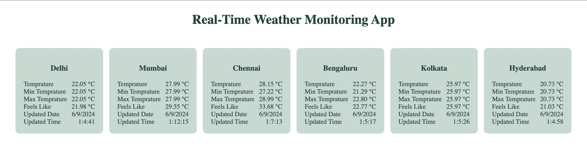
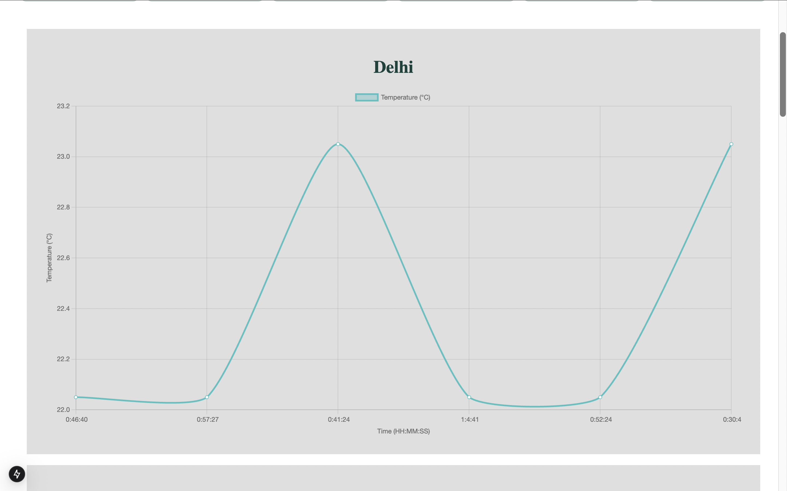
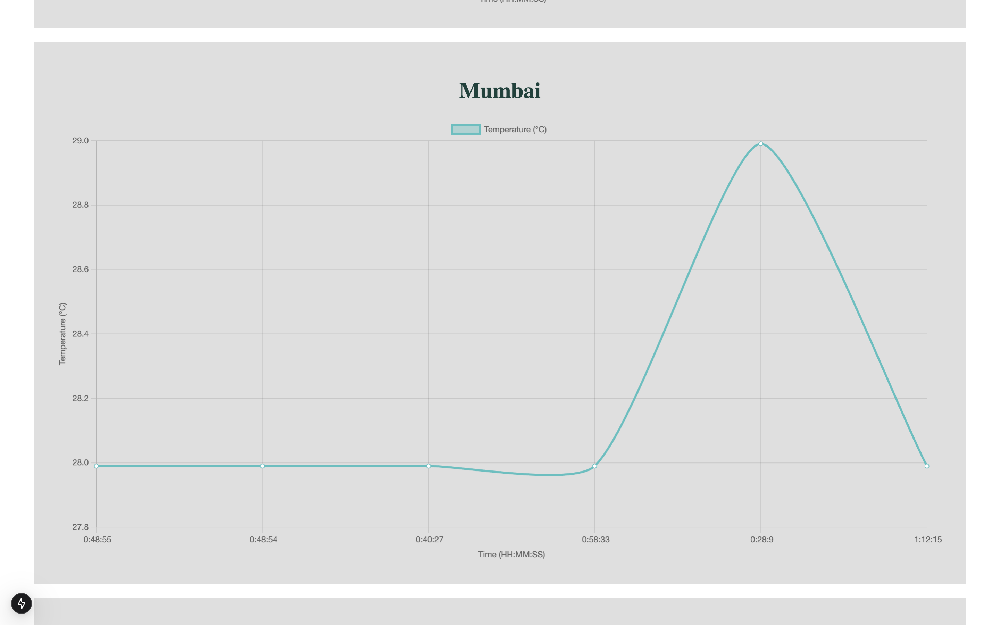
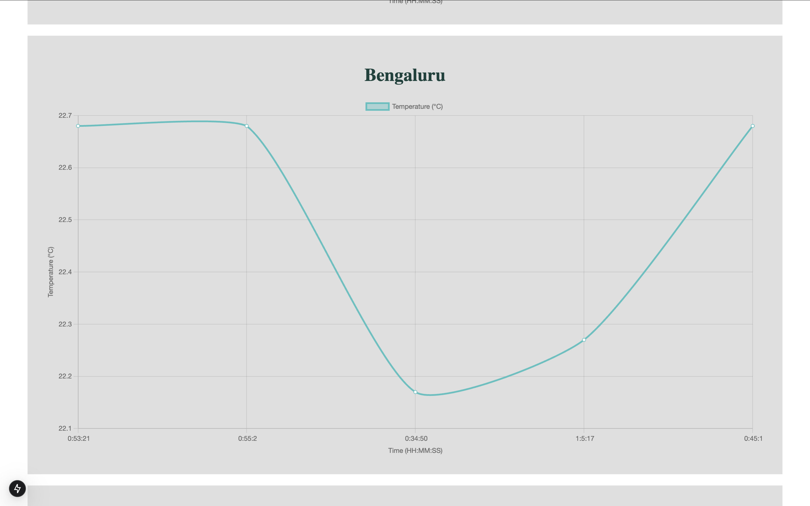
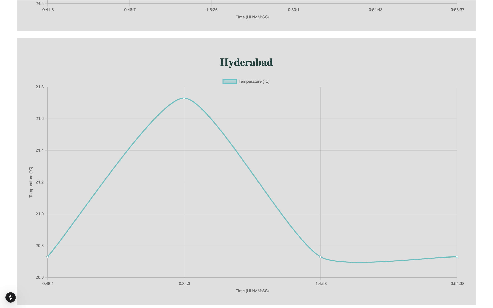
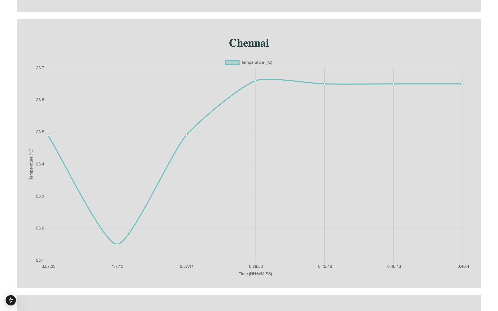

# ZeotapWeatherMonitoringApp
# Real-Time Data Processing System for Weather Monitoring with Rollups and Aggregates

## Objective
The Real-Time Data Processing System is designed to monitor weather conditions in various metro cities in India using real-time data from the [OpenWeatherMap API](https://openweathermap.org/). The system provides summarized insights and analyses through data rollups and aggregates. It features configurable weather alerting thresholds and various data visualizations for daily summaries and historical trends.
## WebApp Snapshots






## Project Architecture
- **Frontend**: [Next.js](https://nextjs.org/) (React-based framework for server-side rendering and API routes)
- **Backend**: [Spring Boot](https://spring.io/projects/spring-boot) (Java-based backend framework with REST API for weather data processing)
- **Database**: [MongoDB](https://www.mongodb.com/) (NoSQL database for storing weather data, daily rollups, and user-configurable thresholds)
- **API Source**: [OpenWeatherMap API](https://openweathermap.org/) for weather data.

## Features
1. **Real-time Data Retrieval**: Retrieves weather data from OpenWeatherMap API at a configurable interval (e.g., every 5 minutes).
2. **Data Rollups and Aggregates**:
   - Calculates daily weather summaries (average, max, min temperatures, and dominant weather conditions).
3. **Alerting System**: Allows user-configurable alert thresholds for parameters like temperature and triggers alerts for threshold breaches.
4. **Visualization**: Displays daily summaries, trends, and triggered alerts.


## Getting Started

### Prerequisites
- **Node.js** (for Next.js frontend)
- **Java 17+** (for Spring Boot backend)
- **MongoDB** (or use Docker to deploy it in a container)
- **OpenWeatherMap API Key** (sign up [here](https://openweathermap.org/) for a free API key)

### Installation

#### Step 1: Clone the Repository
```bash
git clone https://github.com/your-username/your-repo-name.git
cd your-repo-name
```
#### Step 2: Setting up environment
##### OpenWeatherMap API Key
```bash
OPENWEATHER_API_KEY=your_openweather_api_key
```
##### MongoDB Connection
```bash
MONGO_URI=mongodb://localhost:27017/weather-monitoring
```
##### Server Ports
```bash
FRONTEND_PORT=3000
BACKEND_PORT=8080
```

#### Step 3: Install Dependencies
##### Frontend
```bash
cd frontend
npm install
```
##### Backend
```bash
cd backend
./mvnw clean install
```
#### Step 4: Run Application

##### Frontend
```bash
cd frontend
npm run dev
```

##### Backend
```bash
cd backend
./mvnw spring-boot: run
```

The application will now be accessible on:
-Frontend: http://localhost:3000
-Backend: http://localhost:8080

## Design Choices

##### Frontend (Next.js)
- React Components: Efficiently renders weather data and enables a modern, dynamic UI.
- Server-Side Rendering: Ensures fast data loading and improves SEO.
- API Routes: Simplifies communication between Next.js frontend and Spring Boot backend.
##### Backend (Spring Boot)
- REST API: Exposes endpoints for frontend to access weather data and aggregated summaries.
- Service Layer: Handles data retrieval, rollup calculations, and alerting logic.
- Persistence Layer: Stores processed weather data in MongoDB for data analytics.
##### Database (MongoDB)
- NoSQL Structure: Flexible schema for real-time weather data and daily aggregates.
- Rollups and Aggregates: Stores calculated daily summaries for fast retrieval.

## Dependencies
##### Frontend (Next.js)
react-chartjs-2: For data visualizations and trend analysis.
axios: For API requests to the backend.
dotenv: Manages environment variables.

##### Backend (Spring Boot)
Spring Boot Starter Web: Builds RESTful web services.
Spring Boot Starter Data MongoDB: Integrates MongoDB.
Project Lombok: Reduces boilerplate code for model classes.

##### Database
MongoDB: Stores real-time weather data and aggregates.
MongoDB Compass: Provides centralized MongoDB application for easy setup.
